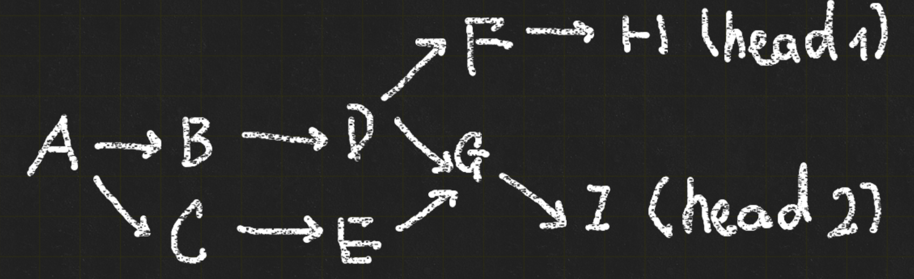

# Gitlet Design Document

**Name**:


### 环境配置

测试

- 更换pwd 针对多个目录的操作
- 

每次调用只执行一个命令，也就是所有的信息 包括commit等都要序列化到gitlet中

可改进：递归执行 而不是单纯将文件夹看成一个文件对象


```
cd ./testing
D:\2024\CS61B projects\CS61B_gitlet\gitlet\target\classes\gitlet
.\gitlet\target\classes\gitlet
python tester.py --verbose test01-init.in
python tester.py --verbose --progdir=".\gitlet\target\classes\gitlet" test01-init.in


python tester.py --verbose --progdir="D:/2024/CS61B_projects/CS61B_gitlet/target/classes" D:/2024/CS61B_projects/CS61B_gitlet/testing/samples/test01-init.in

java -cp D:\2024\CS61B projects\CS61B_gitlet\gitlet\target gitlet.Main


python tester.py samples/test01-init.in
python tester.py samples/test02-basic-checkout.in //not available


java -cp D:\2024\CS61B_projects\CS61B_gitlet gitlet.Main
```


temp command

```
python tester.py --verbose ./samples/test15-remove-add-status.in
```

error information

```
ec-test01-untracked:
ERROR (incorrect output with my output [=== Branches ===
*master

=== Staged Files ===

=== Removed Files ===

=== Modifications Not Staged For Commit ===

=== Untracked Files ===

])
ec-test10-diff-head-working:
FAILED (file text1.txt could not be copied to f.txt)
ec-test10-remote-fetch-push:
FAILED (file wug2.txt could not be copied to k.txt)
ec-test11-diff-branch-working:
FAILED (file text1.txt could not be copied to f.txt)
ec-test11-remote-fetch-pull:
ERROR (incorrect output with my output [No command with that name exists.
])
ec-test12-bad-remotes-err:
FAILED (file wug2.txt could not be copied to k.txt)
ec-test12-diff-two-branches:
FAILED (file text1.txt could not be copied to f.txt)
test01-init:
OK
test02-basic-checkout:
ERROR (java gitlet.Main exited with code 1)
test03-basic-log:
OK
test04-prev-checkout:
ERROR (java gitlet.Main exited with code 1)
test11-basic-status:
OK
test12-add-status:
OK
test13-remove-status:
OK
test14-add-remove-status:
OK
test15-remove-add-status:
OK
test16-empty-commit-err:
OK
test17-empty-commit-message-err:
OK
test18-nop-add:
OK
test19-add-missing-err:
OK
test20-status-after-commit:
OK
test21-nop-remove-err:
OK
test22-remove-deleted-file:
OK
test23-global-log:
OK
test24-global-log-prev:
ERROR (java gitlet.Main exited with code 1)
test25-successful-find:
OK
test26-successful-find-orphan:
ERROR (java gitlet.Main exited with code 1)
test27-unsuccessful-find-err:
ERROR (incorrect output with my output [])
test28-checkout-detail:
ERROR (java gitlet.Main exited with code 1)
test29-bad-checkouts-err:
ERROR (java gitlet.Main exited with code 1)
test30-branches:
ERROR (java gitlet.Main exited with code 1)
test30-rm-branch:
OK
test31-duplicate-branch-err:
OK
test31-rm-branch-err:
OK
test32-file-overwrite-err:
OK
test33-merge-no-conflicts:
FAILED (file wug2.txt could not be copied to h.txt)
test34-merge-conflicts:
FAILED (file wug2.txt could not be copied to h.txt)
test35-merge-rm-conflicts:
FAILED (file wug2.txt could not be copied to h.txt)
test36-merge-err:
FAILED (file wug2.txt could not be copied to h.txt)
test36-merge-parent2:
ERROR (file f.txt present)
test37-reset1:
FAILED (file wug2.txt could not be copied to h.txt)
test38-bad-resets-err:
FAILED (file wug2.txt could not be copied to h.txt)
test39-short-uid:
ERROR (java gitlet.Main exited with code 1)
test40-special-merge-cases:
FAILED (file wug2.txt could not be copied to h.txt)
test41-no-command-err:
OK
test42-other-err:
OK
test43-criss-cross-merge-b:
ERROR (java gitlet.Main exited with code 1)
test43-criss-cross-merge:
ERROR (file f.txt has incorrect content)
test44-bai-merge:
FAILED (file a.txt could not be copied to A.txt)

Ran 49 tests. 22 passed.
make[1]: *** [check] Error 1
make[1]: Leaving directory `D:/2024/CS61B_projects/CS61B_gitlet/testing'
make: *** [check] Error 2

```


```
python tester.py --verbose ./samples/test04-prev-checkout.in
该命令有效，用于指定某一个测试而不是用make check执行所有测试
会单独新建一个暂时的文件夹，可以重复执行
windows下路径用反斜杠分隔，但因为转义问题（e.g. \n）使用正斜杠更好
```

in the run configuration page, set working directory and debug

**目前具有四种执行/debug方式**

- 在IDE里触发 设置工作目录与参数，逐步调试
- 将java的main class注册到系统变量中，在任何目录打开命令行用如gitlet init的命令即可执行，**修改代码后要编译！**
- python tester.py --verbose FILE.in 的方式执行单个集成测试  **修改代码后要编译！**
- make default/check 执行全部集成测试  **修改代码后要编译！**

bat文件记录

```
 && gitlet commit "version 1 of wug.txt" && echo This is not a wug. > wug.txt && gitlet add wug.txt
```


### 对branch与merge的理解

当前仓库唯一的head 一定是当前分支的head

但分支没有之前所想象的重要/强大，分支（的head）本质只是一个指向commit的名字，是暂时的

但commit是一经提交不会改变的 除非由于没有东西（分支，tag，head）引用它导致丢失（一经离开，切换到其它commit就无法再找到这个commit）这个commit最终被垃圾回收

**track一个分支的历史是完全没有意义的**，对一个branch来说只有head是有用的，它曾经head指向过谁完全没有意义

在正常的提交路径下，一个分支的历史比如是从主干分出、单独开发、合并回去的清晰路径

但假如把当前分支的head指向一个与该分支毫无关系的commit上也完全没有问题

​	如main和dev分支的head为c1，c2，将main的head切换到c2，OK，当前分支还是main，进行一次新提交得到commit c3，此时当前分支为main，c3的parent是c2（commit tree是immutable的），当前分支的head是c3，这是完全合法的

但此时的问题是，原本head指向的c1没有被任何东西引用，它会被垃圾回收





在E执行gitlet merge branchD,则此时G的parentCommits第一个是E第二个是D

如果链状回溯（像log时一样只取第一个） 得到的split point就是A，但实际上应该是D

因此findAncestor应该用类似dfs的方法


mechanism for merge


这里add by both A and B 与 modified by both 可以应用同样的逻辑


```
HashSet<String> filesAddedByA = new HashSet<>(currentCommit.tracked_file_names);
        filesAddedByA.removeAll(splitPoint.tracked_file_names);
        HashSet<String> filesAddedByB = new HashSet<>(givenCommit.tracked_file_names);
        filesAddedByB.removeAll(splitPoint.tracked_file_names);
        HashSet<String> filesAddedByAandB = new HashSet<>(filesAddedByA);
        filesAddedByAandB.retainAll(filesAddedByB);
        //(A union B) - (A intersect B)
        HashSet<String> filesAddedByOnlyAorB = new HashSet<>(filesAddedByA);
        filesAddedByOnlyAorB.addAll(filesAddedByB);
        filesAddedByOnlyAorB.removeAll(filesAddedByAandB);
```


感觉是不是checkout一个branch的时候才会有这个提示"There is an untracked file in the way; delete it, or add and commit it first."

因为merge中调用了checkoutBranch的代码 所以它的这个提示也来源于这里

merge考虑的一直是A、B、splitPoint的blob（tracked files）之间的关系，一个untracked file并不会因为这些操作被删除吧


### Commit message规范


| Type       | 说明                         | 示例                                |
| ---------- | ---------------------------- | ----------------------------------- |
| `feat`     | 添加新功能                   | `feat(fwd): add forward pass logic` |
| `fix`      | 修复 bug                     | `fix(rev): correct gradient bug`    |
| `docs`     | 修改文档                     | `docs(readme): update usage guide`  |
| `style`    | 代码格式修改（不影响逻辑）   | `style(loma): reformat indentation` |
| `refactor` | 重构代码（无新增功能或修复） | `refactor(core): clean up loops`    |
| `perf`     | 性能优化                     | `perf(rev): speed up backprop`      |
| `test`     | 添加或修改测试               | `test(loma): add unit tests`        |
| `build`    | 构建系统变更（如 Makefile）  | `build(ci): add build step`         |
| `ci`       | 持续集成配置                 | `ci(github): update workflow`       |
| `chore`    | 杂项，不影响源代码或测试     | `chore(deps): update dependencies`  |
| `revert`   | 回滚提交                     | `revert: undo feat(rev) commit`     |

- `api`：接口层
- `ui`：前端或界面
- `core`：核心逻辑
- `test`：测试模块
- `docs`：文档相关


### Tests

- 新建/切换branch，简单merge

```

```


 && gitlet add wug.txt && gitlet commit 'commit in main'


如果add完改回去了怎么办

如果一个文件先被移除又被添加怎么办

修改后的version对判断split point有没有影响


