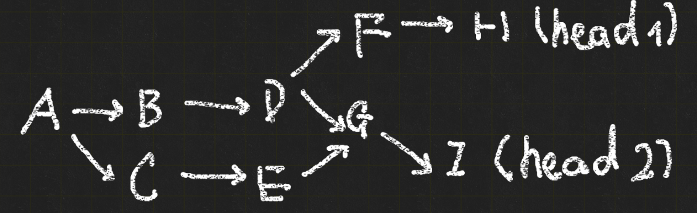
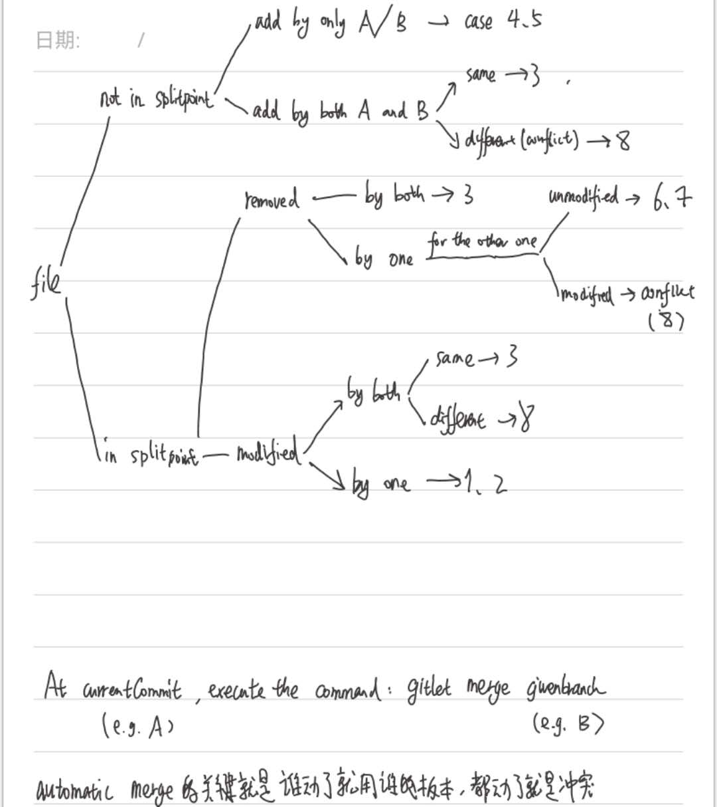

# Gitlet Design Document

### 项目概述

实现了UCB-CS61B-21spring-gitlet与测试

guidebook: [Project 2: Gitlet | CS 61B Spring 2021](https://sp21.datastructur.es/materials/proj/proj2/proj2#a-note-on-this-spec)

项目本身局限：

- add等命令一次只支持对一个文件进行操作
- 不支持处理更复杂的文件结构，即把仓库中的所有File（文件或目录）都视为单一的文件处理而不考虑其内部结构

### 环境配置与本地测试

官方oj：https://www.gradescope.com/

可以选课选学期学校填UCB选课码随便找个还没过期的即可

但我不知道为什么一提交上去就报错所以一直在本地测试orz

---------------

运行：win11

项目本身做了一些linux和win的兼容（如一些分隔符）但并不完全

应该本来是为linux系统上设计的 如make中的touch命令等

可以使用git bash等在win上支持unix环境命令的命令行来执行make命令

---------

```
python tester.py --verbose ./samples/test04-prev-checkout.in
该命令有效，用于指定某一个测试而不是用make check执行所有测试
会单独新建一个暂时的文件夹，可以重复执行
windows下路径用反斜杠分隔，但因为转义问题（e.g. \n）使用正斜杠更好
```

本地测试主要在可以自己编写.in测试文件，与.inc（类似对in的一个封装和复用）

并且用提供的tester.py可以解析.in文件，从而实现文件操作、调用gitlet命令、比较输出、文件的存在性、文件的内容等操作

本项目中添加的测试文件除初始完全来自该仓库：[Yukang-Lian/Gitlet-Testing-Files: Gitlet-Testing-Files](https://github.com/Yukang-LIAN/Gitlet-Testing-Files)

----------

**目前具有四种执行/debug方式**

- 在IDE里触发 设置工作目录与参数，逐步调试
- 将java的main class注册到系统变量中，在任何目录打开命令行用如gitlet init的命令即可执行，**修改代码后要编译！（make default）**
- python tester.py --verbose FILE.in 的方式执行单个集成测试  **修改代码后要编译！（make default）**
- make default/check 执行全部集成测试 

（显然IDE的编译产物和make default的编译产物不在同一个位置）

------------

注意测试中比如用正则表达式匹配log时，其对正确性的检验并不完全

比如只会检测‘大致’的格式是否正确，而其中“Merge: ......”这里是可选的

而当一个commit是merge命令的结果时，如果没有打印这一信息是检测不到的

我在print出混淆了打印merge信息时‘M’的大小写，导致一开始忘记将merged commit的另一个parent加入其parentCommits中（此时记录的commit tree是有问题的，但压根不会触发打印merge信息的代码，导致反而能正确通过测试；在修改commit tree结构为正确形式后，反而因为‘merge’的大小写测试失败

-----

**测试结果**

ec-test（即bonus部分，加入push、remote、pull等命令的实现） **暂未实现**

常规测试中未通过的：

- test33 缺失blank-status2.inc文件
- test36 对checkout中untracked files的理解有误，这里指的不仅仅是没有在当前commit下未被追踪，还包括追踪了但进行了修改总之与已经保存的文件内容不一致的文件，和正常的git一样（很合理）但懒得改了
- test43-criss-cross-merge-b & test43-criss-cross-merge 缺失conflict4.txt conflict5.txt

此外的测试均已通过

### 对branch与merge的设计思路

当前仓库唯一的head 一定是当前分支的head

但分支没有之前所想象的重要/强大，分支（的head）本质只是一个指向commit的名字，是暂时的

但commit是一经提交不会改变的 除非由于没有东西（分支，tag，head）引用它导致丢失（一经离开，切换到其它commit就无法再找到这个commit）这个commit最终被垃圾回收

**track一个分支的历史是完全没有意义的**，对一个branch来说只有head是有用的，它曾经head指向过谁完全没有意义

在正常的提交路径下，一个分支的历史比如是从主干分出、单独开发、合并回去的清晰路径

但假如把当前分支的head指向一个与该分支毫无关系的commit上也完全没有问题

​	如main和dev分支的head为c1，c2，将main的head切换到c2，OK，当前分支还是main，进行一次新提交得到commit c3，此时当前分支为main，c3的parent是c2（commit tree是immutable的），当前分支的head是c3，这是完全合法的

但此时的问题是，原本head指向的c1没有被任何东西引用，它会被垃圾回收





在E执行gitlet merge branchD,则此时G的parentCommits第一个是E第二个是D

如果链状回溯（像log时一样只取第一个） 得到的split point就是A，但实际上应该是D

因此findAncestor应该用类似dfs的方法

------

mechanism for merge



这里add by both A and B 与 modified by both 可以应用同样的逻辑

但实际上其中存在大量的重复情况，直接按这些cases编写代码不仅可能导致代码复用差，还可能遗漏一些情况

因此我们只考虑两种情况（注意此时currentCommit和givenCommit从整体上的新旧是不可比的）：

- 在currentCommit（即在此分支执行merge命令）中的文件：考虑是不是要删去/encounter a merge conflict

- 不在currentCommit中的文件，考虑要加到merged commit中，那么需要考虑哪些文件？

  实际上只需要考虑givenCommit中的所有文件，不需要考虑splitpoint的文件在于，如果这个文件被givenCommit保留或修改了，那么在考虑givenCommit文件时已经被包括进去了；而如果这个文件同时也被givenCommit删掉了，这就不是一个冲突了（两个开发都删掉了这个文件）

### git使用规范

参考： 帮助你养成良好的 Git 使用习惯 - 白日灯火的文章 - 知乎 https://zhuanlan.zhihu.com/p/1897303521113666192


| Type       | 说明                         | 示例                                |
| ---------- | ---------------------------- | ----------------------------------- |
| `feat`     | 添加新功能                   | `feat(fwd): add forward pass logic` |
| `fix`      | 修复 bug                     | `fix(rev): correct gradient bug`    |
| `docs`     | 修改文档                     | `docs(readme): update usage guide`  |
| `style`    | 代码格式修改（不影响逻辑）   | `style(loma): reformat indentation` |
| `refactor` | 重构代码（无新增功能或修复） | `refactor(core): clean up loops`    |
| `perf`     | 性能优化                     | `perf(rev): speed up backprop`      |
| `test`     | 添加或修改测试               | `test(loma): add unit tests`        |
| `build`    | 构建系统变更（如 Makefile）  | `build(ci): add build step`         |
| `ci`       | 持续集成配置                 | `ci(github): update workflow`       |
| `chore`    | 杂项，不影响源代码或测试     | `chore(deps): update dependencies`  |
| `revert`   | 回滚提交                     | `revert: undo feat(rev) commit`     |

程序部分划分（并不绝对..）

- `api`：接口层
- `ui`：前端或界面
- `core`：核心逻辑
- `test`：测试模块
- `docs`：文档相关


